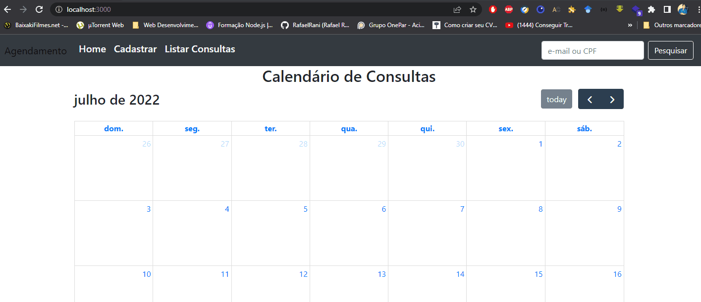

<h1 align="center">:calendar: Sistema de Agendamento de Consultas :date:</h1>
Sistema de agendamento de consultas que permite ao usuário marcar consultas na data e horários escolhidos, enviando notificação por email quando chegar próximo da data da consulta.

## :white_check_mark: Features

- [X] Cadastrar consulta
- [X] Listar consultas
- [X] Finalizar consulta
- [X] Pesquisar consulta por email ou CPF
- [X] Enviar notificação por email

## :camera: Demonstração

<div align="center" >
  
</div>

## :clipboard: Pré-requisitos

Antes de começar, você vai precisar ter instalado em sua máquina as seguintes ferramentas:
[GIT](https://git-scm.com/), [Node.js](https://nodejs.org/en/), [MongoDB](https://www.mongodb.com/).  
Além disto, é bom ter um editor para trabalhar com código como [VSCode](https://code.visualstudio.com/)

## :computer: Rodando a aplicação

```bash
# Clone este repositório
$ git clone https://github.com/RafaelRani/Sistema-de-Agendamento.git

# Acesse a pasta do projeto no terminal/cmd
$ cd Sistema-de-Agendamento

# Instale as dependências
$ npm i

# Execute a aplicação em modo de desenvolvimento
$ nodemon index.js

# O servidor iniciará na porta:3000 - acesse: <http://localhost:3000>
```

## :rocket: Tecnologias

Esse projeto foi desenvolvido com as seguintes tecnologias:  
:heavy_check_mark: Node  
:heavy_check_mark: Express  
:heavy_check_mark: MongoDB  
:heavy_check_mark: Javascript  
:heavy_check_mark: HTML  
:heavy_check_mark: Bootstrap  
  
Made with :purple_heart: Rafael Rani :wave: [Get in touch!](https://www.linkedin.com/in/rafaelrani/)
